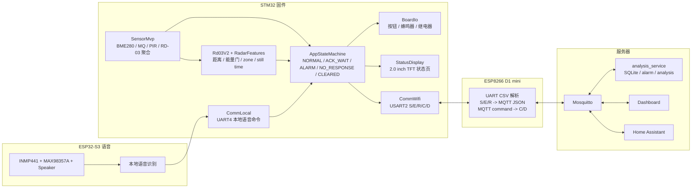
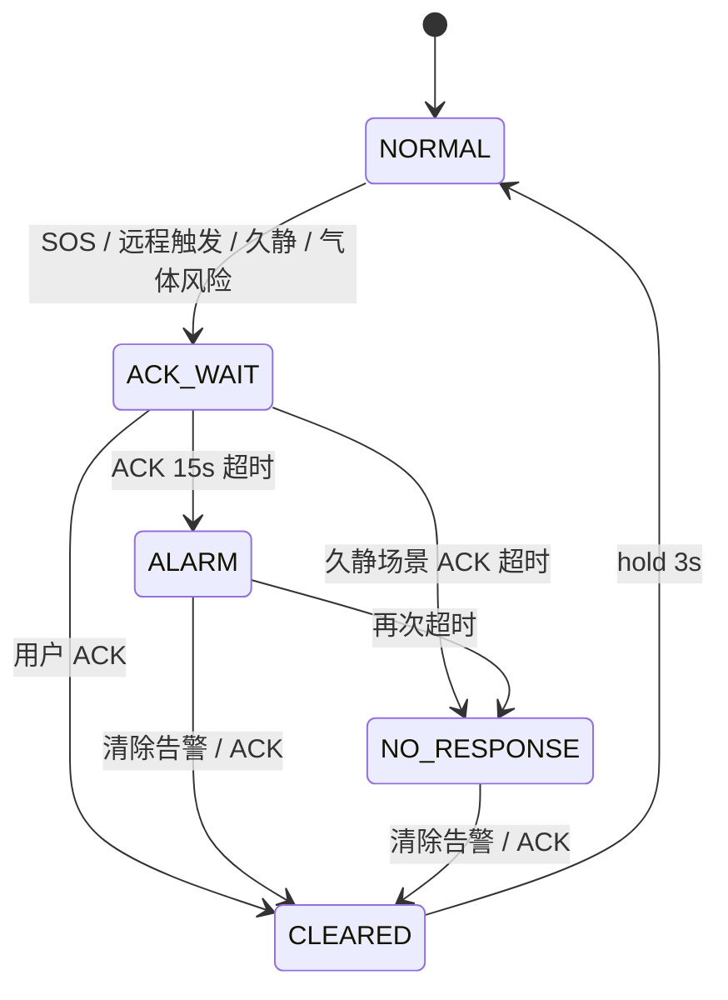

# System Schematic

更新时间：2026-07-07

本文档根据当前代码、`Docs/pinmap.md`、`Docs/protocol.md`、`Docs/prototype_fixture_design.md` 以及最新底座布局说明整理。这里的“原理图”先指系统级连接原理图和数据流图，不替代 KiCad 电气原理图；所有最终接线仍以 `Docs/pinmap.md` 为唯一权威来源。

## 1. 总体结构

系统以 `NUCLEO-U5A5ZJ-Q / STM32U5A5ZJ` 为本地主控，负责传感器采集、状态机、TFT 显示、蜂鸣器、继电器和本地按钮。`ESP8266 D1 mini` 作为 UART 到 MQTT 的联网网关。`ESP32-S3-N16R8` 是独立语音模块，通过 I2S 麦克风和功放完成语音输入/播放，并通过 UART4 向 STM32 发送语义命令。

```mermaid
flowchart LR
  subgraph Base["开发板底座 / 主控层"]
    PWR["面包板电源模块<br/>外部 5V / 共地"]
    MCU["NUCLEO-U5A5ZJ-Q<br/>STM32U5A5ZJ<br/>主控 / 状态机 / 本地自治"]
    WIFI["ESP8266 D1 mini<br/>UART CSV <-> MQTT JSON"]
    RELAY["HW-280 四路继电器<br/>5V / 高电平触发"]
  end

  subgraph Panel["右侧竖立半块面包板 / 交互面板"]
    TFT["2.0 inch TFT<br/>240 x 320<br/>SPI1"]
    BTN["SOS / ACK<br/>两个控制按钮"]
  end

  subgraph Detached["离体模块 / 杜邦线飞线固定"]
    MQ["1 MQ-2<br/>AO 模拟量"]
    RD["2 RD-03V2<br/>24GHz 毫米波雷达"]
    BZ["3 无源蜂鸣器<br/>TIM1 PWM"]
    BME["4 BME280<br/>温湿度 / 气压"]
    PIR["5 HC-SR501 PIR<br/>人体活动数字输出"]
  end

  subgraph Voice["独立语音模块"]
    S3["ESP32-S3-N16R8<br/>语音识别 / 播放"]
    MIC["INMP441<br/>I2S 麦克风"]
    AMP["MAX98357A<br/>I2S 功放"]
    SPK["3W 8 ohm 喇叭"]
  end

  subgraph Cloud["本地或云端服务器"]
    MQTT["Mosquitto MQTT"]
    ANA["analysis_service<br/>规则 / 事件 / 告警"]
    DASH["Dashboard / Home Assistant"]
  end

  PWR --> MCU
  PWR --> WIFI
  PWR --> RELAY
  PWR --> MQ
  PWR --> PIR
  MCU --> TFT
  BTN --> MCU
  MQ --> MCU
  RD <--> MCU
  BZ <-- MCU
  BME <--> MCU
  PIR --> MCU
  MCU <--> WIFI
  WIFI <--> MQTT
  MQTT <--> ANA
  MQTT <--> DASH
  MCU --> RELAY
  RELAY --> LED1["LED 射灯 1"]
  RELAY --> LED2["LED 射灯 2"]
  MIC --> S3
  S3 --> AMP
  AMP --> SPK
  S3 --> MCU
```

## 2. 底座相对位置

按最新手绘图和说明，底座不是房间分层图，而是开发板结构底座：

- 左侧两个立柱为 `A/B`，用于撑起上层盖板。
- 左上角是面包板电源模块。
- 中间是 `STM32U5` 主控板和当前软件库中的主控部分。
- 右上角是 `ESP8266 D1 mini`。
- 右下角是四路继电器，1 号位接 `LED 射灯 1`，2 号位接 `LED 射灯 2`，3/4 号位预留。
- 最右侧是竖起来的半块面包板，放 `2.0 英寸 TFT` 和两个控制按钮。
- 离体 1-5 通过飞线/杜邦线连接，需要后续固定：`MQ-2`、`RD-03V2`、`无源蜂鸣器`、`BME280`、`PIR`。

```text
俯视方向，正面朝观众

┌──────────────────────────────────────────────────────────────┐
│  面包板电源           立柱 A / B                              │
│                                                              │
│                 ┌────────────────────┐     ESP8266 D1 mini   │
│                 │   STM32U5 NUCLEO   │                       │
│                 │   主控 / 软件核心   │                       │
│                 └────────────────────┘                       │
│                                                              │
│  离体 1 MQ-2       离体 2 RD-03V2       ┌──────────────────┐ │
│  离体 4 BME280     离体 5 PIR           │ 竖立半块面包板    │ │
│  离体 3 蜂鸣器                           │ 2.0 inch TFT     │ │
│                                         │ SOS / ACK 按钮   │ │
│                                         └──────────────────┘ │
│                                     四路继电器 -> LED1/LED2  │
└──────────────────────────────────────────────────────────────┘
```

## 3. STM32 硬件连接原理

```mermaid
flowchart TB
  MCU["STM32U5A5ZJ"]

  BME["BME280<br/>3.3V"]
  MQ["MQ-2<br/>5V 供电<br/>AO 经 2k/3.3k 分压"]
  PIR["HC-SR501 PIR<br/>5V 供电<br/>OUT 约 3.3V"]
  RD["RD-03V2<br/>3.3V<br/>UART + OT2"]
  TFT["2.0 inch TFT<br/>3.3V<br/>8-pin SPI write-only"]
  WIFI["ESP8266 D1 mini<br/>外部 5V / 共地"]
  S3["ESP32-S3 语音模块<br/>3.3V UART 逻辑"]
  RELAY["HW-280 Relay x4<br/>5V / High trigger"]
  BUZZ["无源蜂鸣器<br/>TIM1_CH1 PWM"]
  BTN["SOS / ACK 自锁按钮<br/>闭合接地"]
  DBG["ST-LINK VCP / COM6<br/>调试串口"]

  BME -- "I2C1: PB8 SCL / PB9 SDA" --> MCU
  MQ -- "ADC1_IN4: PC3 / A2" --> MCU
  PIR -- "GPIO: PB0 / A3 / PIR_IN" --> MCU
  RD -- "OT2: PC1 / A4" --> MCU
  RD -- "USART3: PB10 TX -> RX<br/>PB11 RX <- OT1<br/>RX DMA" <--> MCU
  TFT -- "SPI1: PA5 SCK / PA7 MOSI<br/>PD14 CS / PF13 DC / PF12 RST / PD15 BL" <-- MCU
  WIFI -- "USART2: PA2 TX -> RX<br/>PA3 RX <- TX<br/>115200 8N1" <--> MCU
  S3 -- "UART4: PA0 TX -> RX<br/>PA1 RX <- TX<br/>C/D 语义命令" <--> MCU
  RELAY -- "GPIO: PE13 IN1 / PF14 IN2<br/>PE11 IN3 / PC0 IN4" <-- MCU
  BUZZ -- "PE9 / TIM1_CH1 / 2kHz PWM" <-- MCU
  BTN -- "PG8 SOS / PG7 ACK<br/>Pull-up, active low" --> MCU
  DBG -- "USART1: PA9 TX / PA10 RX" <--> MCU
```

## 4. 关键接线表

| 模块 | 信号 | STM32 连接 | 说明 |
| --- | --- | --- | --- |
| BME280 | SCL/SDA | `PB8/PB9`，`I2C1` | 3.3V 供电，地址 `0x76` |
| MQ-2 | AO | `PC3 / A2 / ADC1_IN4` | MQ 用 5V，AO 必须经 `2k/3.3k` 分压 |
| PIR | OUT | `PB0 / A3 / PIR_IN` | 离体 5，数字人体活动输入 |
| RD-03V2 | OT2 | `PC1 / A4 / RD03_OUT` | 有人/无人快速数字输出 |
| RD-03V2 | RX / OT1 | `PB10 USART3_TX` / `PB11 USART3_RX` | UART 主数据源，115200 8N1，RX DMA |
| TFT | SCL/SDA | `PA5 SPI1_SCK` / `PA7 SPI1_MOSI` | 屏幕丝印 SCL/SDA 是 SPI，不是 I2C |
| TFT | CS/DC/RST/BL | `PD14/PF13/PF12/PD15` | 2.0 英寸 240 x 320，当前按 ST7789 初始化 |
| ESP8266 | RX/TX | `PA2 USART2_TX` / `PA3 USART2_RX` | STM32 CSV 与 MQTT JSON 网关 |
| ESP32-S3 语音 | RX/TX | `PA0 UART4_TX` / `PA1 UART4_RX` | 发送识别后的 `C/D` 命令，不传原始音频 |
| 继电器 1-4 | IN1-IN4 | `PE13/PF14/PE11/PC0` | 高电平触发，bit0-bit3 对应 1-4 路 |
| 蜂鸣器 | IO | `PE9 / TIM1_CH1` | 无源蜂鸣器 PWM |
| SOS/ACK | 输入 | `PG8/PG7` | 上拉，闭合接地，低电平有效 |

## 5. 软件与通信原理



STM32 主循环实际执行顺序大致为：

```text
SensorMvp_Update
-> AppStateMachine_Update
-> BoardIo_Update
-> 调试串口命令处理
-> 云端 C/D 命令处理
-> 语音 C/D 命令处理
-> 继电器自动化
-> E 事件帧发送
-> TFT 协作刷新
-> 每 2 秒发送 S 状态帧
-> 每 2 秒输出 AI_SAMPLE 日志
-> 500 ms 板载 LED 心跳
```

## 6. 业务闭环



继电器自动策略：

- 继电器 1：护理告警灯。`ACK_WAIT`、`ALARM`、`NO_RESPONSE` 自动吸合。
- 继电器 2：离线提示灯。`APP_NETWORK_OFFLINE` 自动吸合。
- 继电器 3/4：当前预留，支持手动或云端命令。
- 最终输出为 `manual mask | auto mask`，ACK 或 clear 会清掉手动 mask，再按状态机重算自动 mask。

## 7. UART / MQTT 数据方向

```text
STM32 -> ESP8266:
S,seq,temperature,humidity,gas,presence,risk,relay_state_mask,cloud_perm_mask
E,event_id,scenario,event_type,trigger_source,state_before,state_after,risk,result,network_state,power_state,flags,timestamp_ms
R,request_id,relay_id,result,state,reason

ESP8266 -> STM32:
C,request_id,relay_id,ON|OFF
D,request_id,command_type,scenario,value

ESP32-S3 Voice -> STM32:
C,request_id,relay_id,ON|OFF
D,request_id,command_type,scenario,value
```

主要 MQTT topic：

| Topic | 用途 |
| --- | --- |
| `eldercare/node01/status` | 周期状态 |
| `eldercare/node01/event` | 关键事件 |
| `eldercare/node01/alarm` | 当前告警 |
| `eldercare/node01/analysis` | 云端规则/LLM 分析 |
| `eldercare/node01/demo/command` | Dashboard 演示命令 |
| `eldercare/node01/relay/1/set` ~ `relay/4/set` | 继电器云控 |
| `eldercare/node01/relay/1/state` ~ `relay/4/state` | 继电器最终状态 |
| `eldercare/node01/relay/1/result` ~ `relay/4/result` | 继电器执行结果 |

## 8. 当前注意事项

- TFT 是 `2.0 英寸`，不是 4 英寸；当前接线和驱动按 `2.0 inch 240 x 320 SPI` 处理。
- 当前离体模块编号为：`1 MQ-2`、`2 RD-03V2`、`3 无源蜂鸣器`、`4 BME280`、`5 PIR`。
- 继电器第一阶段只接低压 LED 演示，不接市电负载。
- `ESP32-S3-N16R8` 语音模块是独立模块；当前仓库中的 `esp32-voice-recognition/src/main.cpp` 主要是 I2S 麦克风可达性/VAD 测试，STM32 侧已经预留 UART4 接收 `C/D` 语义命令。
- 仓库文档中存在 RuView Wi-Fi CSI 增强路线，它是并行感知子系统，不替代当前 STM32 + ESP8266 主链路。
